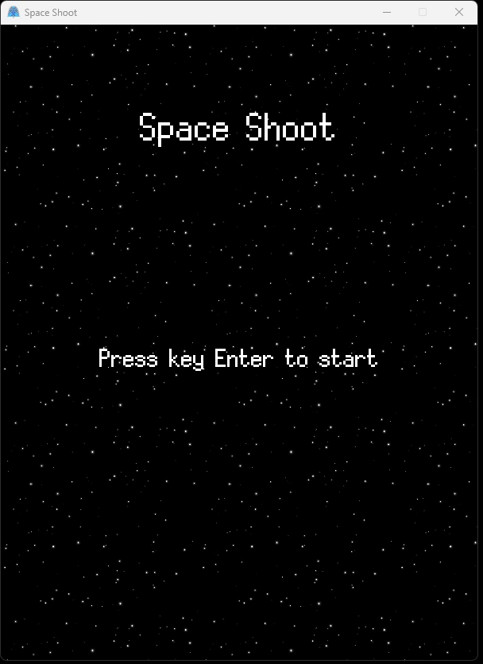
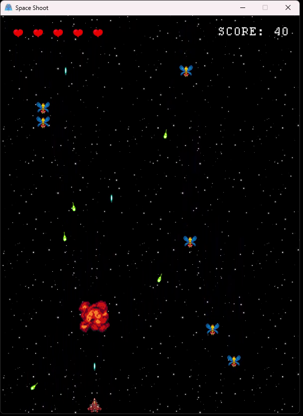
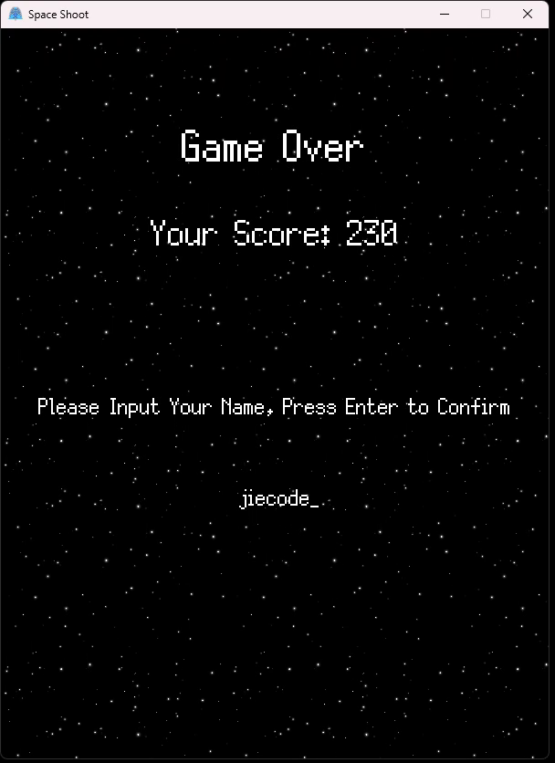

# 目录
## 游戏介绍
### 游戏背景
| 游戏名称 | 介绍 |
| --- | --- |
| Space Shooter | 太空战机是一款经典的2D游戏，它以太空飞行为主题，玩家操作一架飞机，通过射击、躲避、收集物品等方式获得分数。
### 游戏玩法
| 操作 | 介绍 |
| --- | --- |
| 移动 | 玩家可以用方向键**WSAD**移动飞机
| 射击 | 玩家可以用**空格键**发射子弹，飞机会随机出现在屏幕上，玩家需要躲避飞机或者选择击落飞机以获得分数，否则会受到伤害
| 开始游戏 | 在主菜单界面，玩家可以按**Enter**键开始游戏
| 暂停 | 玩家可以按**P**键暂停游戏
| 全屏 | 玩家可以按**F11**键切换全屏模式
### 游戏内容

* **菜单界面**  
<div align="center">
  
</div>

* **关卡界面**  
<div align="center">
    
</div>

* **结束界面**  
<div align="center">
    
</div>

## 项目结构
```
SpaceShoot
├── CMakeLists.txt           // CMake构建脚本
├── README.md                // 项目说明文档
├── SDL2/                    // 第三方库
├── assets/                  // 资源文件    
├── build/                   // 构建输出目录
├── data/                    // 数据文件
├── design/                  // 设计文件
├── script/                  // 脚本文件
├── src/                     // 源代码目录
```
## 开发环境
* 开发工具：Visual Studio Code
* 编译器：MSVC 19.30.30705
* 语言：C++ 17
* 构建系统：CMake
* 第三方库：SDL2
* 运行平台：Windows11 x64（其他平台未测试）
## 运行方式
### 源码构建
1. 克隆项目到本地
```
git clone https://github.com/1716285375/SpaceShip.git
```
2. 执行cmake命令生成构建文件
```
cd SpaceShip
mkdir build
cd build
cmake ..
```
3. 编译项目
```
cmake --build . --config Release
```
4. 运行游戏
```
cd build/Release
SpaceShip.exe
```
### 下载二进制
1. 下载 **SpaceShoot-Setup.exe 
** 安装包
[windows exe](https://github.com/1716285375/SpaceShip/releases/tag/v1.0.0-beta)
2. 安装程序
3. 双击 **SpaceShoot.exe** 运行
## 附录
### 参考文献
*  [【C++游戏开发之旅】SDL2与太空战机](https://en.wikipedia.org/wiki/Space_Shooter)
* [SDL2 API Documentation](https://wiki.libsdl.org/wiki/index)
