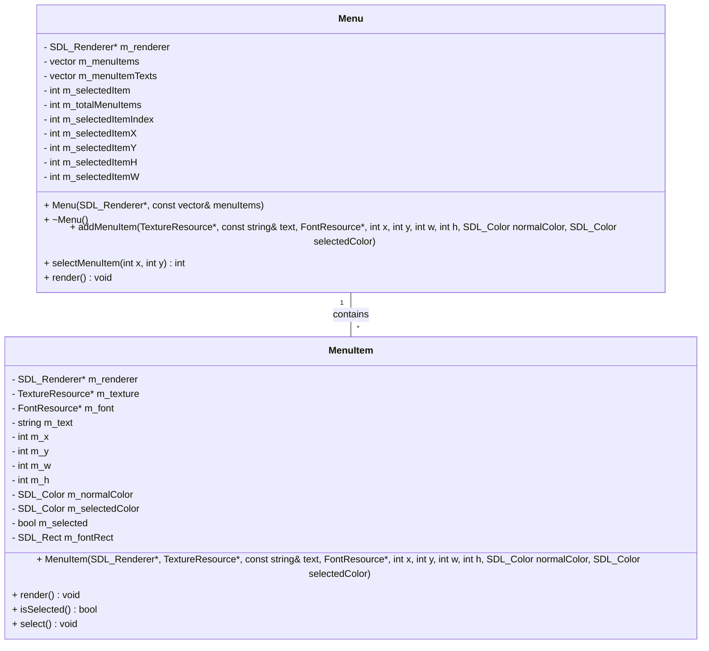

# 目录
## 菜单选项

```mermaid
classDiagram
    class Menu {
        + Menu(SDL_Renderer*, const vector<string>& menuItems)
        + ~Menu()
        + addMenuItem(TextureResource*, const string& text, FontResource*, int x, int y, int w, int h, SDL_Color normalColor, SDL_Color selectedColor)
        + selectMenuItem(int x, int y) int
        + render() void
        - SDL_Renderer* m_renderer
        - vector<MenuItem*> m_menuItems
        - vector<string> m_menuItemTexts
        - int m_selectedItem
        - int m_totalMenuItems
        - int m_selectedItemIndex
        - int m_selectedItemX
        - int m_selectedItemY
        - int m_selectedItemH
        - int m_selectedItemW
    }

    class MenuItem {
        + MenuItem(SDL_Renderer*, TextureResource*, const string& text, FontResource*, int x, int y, int w, int h, SDL_Color normalColor, SDL_Color selectedColor)
        + render() void
        + isSelected() bool
        + select() void
        - SDL_Renderer* m_renderer
        - TextureResource* m_texture
        - FontResource* m_font
        - string m_text
        - int m_x
        - int m_y
        - int m_w
        - int m_h
        - SDL_Color m_normalColor
        - SDL_Color m_selectedColor
        - bool m_selected
        - SDL_Rect m_fontRect
    }

    Menu "1" -- "*" MenuItem : contains
```