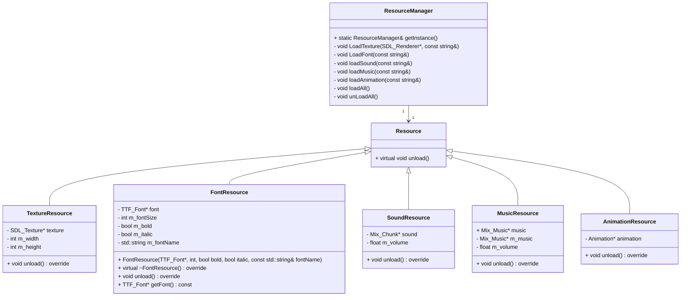

# 目录

## 资源管理

```mermaid
classDiagram
    class ResourceManager {
        + static ResourceManager& getInstance()
        - void LoadTexture(SDL_Renderer*, const string&)
        - void LoadFont(const string&)
        - void loadSound(const string&)
        - void loadMusic(const string&)
        - void loadAnimation(const string&)
        - void loadAll()
        - void unLoadAll()
    }

    ResourceManager "1"--> "1" Resource

    class Resource {
        + virtual void unload()
    }

    class TextureResource{

        + void unload() override
        - SDL_Texture* texture
        - int m_width
        - int m_height
    }
    class FontResource{
        + FontResource(TTF_Font*, int, bool bold, bool italic,  const std::string& fontName)
        + virtual ~FontResource() override
        + void unload() override
        + TTF_Font* getFont() const
        - TTF_Font* font
        - int m_fontSize
        - bool m_bold
        - bool m_italic
        - std::string m_fontName
    }

    class SoundResource{
        
        + void unload() override
        - Mix_Chunk* sound
        - float m_volume
    }

    class MusicResource{
        + Mix_Music* music
        + void unload() override
        - Mix_Music* m_music
        - float m_volume
    }

    class AnimationResource{
        + void unload() override
        - Animation* animation
    }

    Resource <|-- TextureResource
    Resource <|-- FontResource
    Resource <|-- SoundResource
    Resource <|-- MusicResource
    Resource <|-- AnimationResource
```