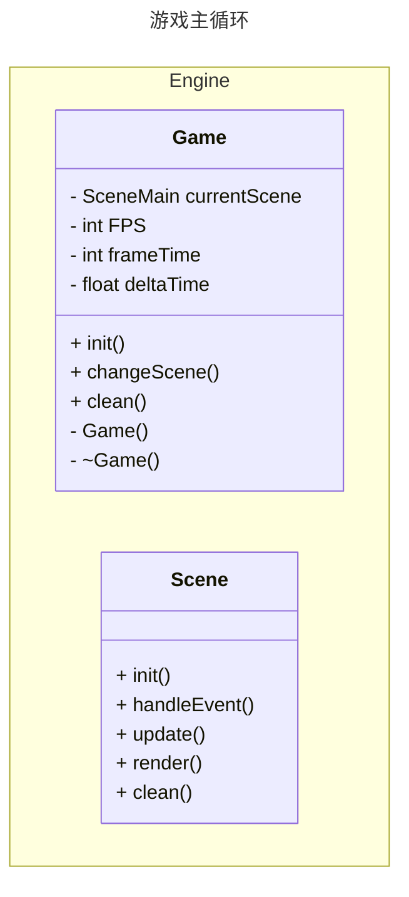
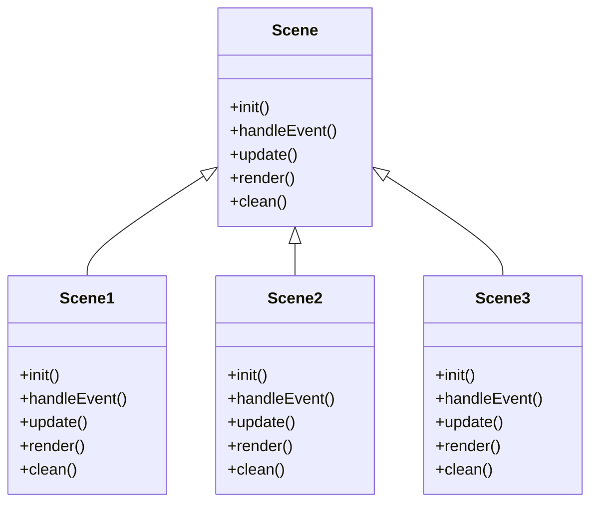
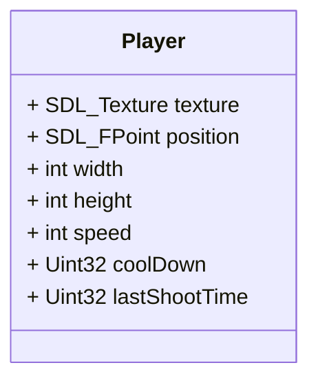
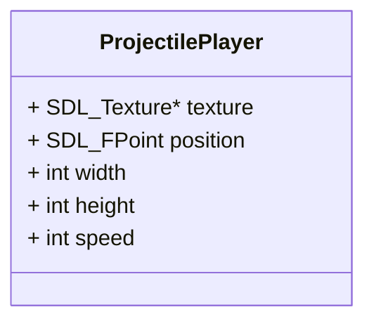
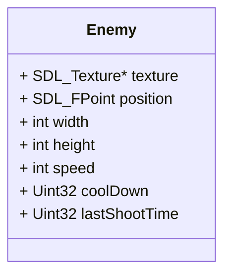

# 目录

## 1. 游戏主循环

### 1.1 引擎类

```mermaid
---
title: 游戏主循环
---
classDiagram 
namespace Engine{

	class Game {
		- SceneMain currentScene
		- int FPS
		- int frameTime
		- float deltaTime
		
		+ init()
		+ changeScene()
		+ clean()
		- Game()
		- ~Game()
		
	}
	class Scene {
		+ init()
		+ handleEvent()
		+ update()
		+ render()
		+ clean()
	}
}

```

## 2. 场景切换

### 2.1 场景类

```mermaid
classDiagram
	class Scene {
		+init()
		+handleEvent()
		+update()
		+render()
		+clean()
	}
 class Scene1 {
		+init()
		+handleEvent()
		+update()
		+render()
		+clean()
 }
class Scene2 {
		+init()
		+handleEvent()
		+update()
		+render()
		+clean()
	}
class Scene3 {
		+init()
		+handleEvent()
		+update()
		+render()
		+clean()
	}
Scene <|-- Scene1
Scene <|-- Scene2
Scene <|-- Scene3
```

## 3. 实体类

### 3.1 玩家类

```mermaid
classDiagram
	class Player {
		+ SDL_Texture texture
		+ SDL_FPoint position
		+ int width
		+ int height
		+ int speed
		+ Uint32 coolDown
		+ Uint32 lastShootTime
	}
```

```mermaid
classDiagram
	class ProjectilePlayer {
		+ SDL_Texture* texture
		+ SDL_FPoint position
		+ int width
		+ int height
		+ int speed
	}
```

### 3.2 敌人类

```mermaid
classDiagram
	class Enemy {
		+ SDL_Texture* texture
		+ SDL_FPoint position
		+ int width
		+ int height
		+ int speed
		+ Uint32 coolDown
		+ Uint32 lastShootTime
	}
```