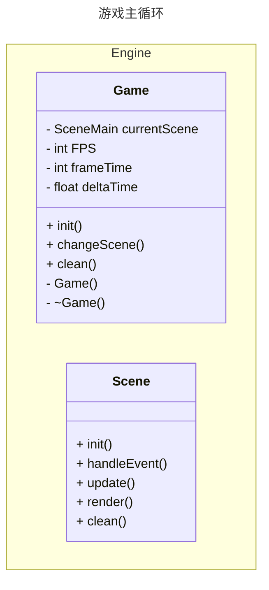

```mermaid
---
title: 游戏主循环
---
classDiagram 
namespace Engine{

	class Game {
		- SceneMain currentScene
		- int FPS
		- int frameTime
		- float deltaTime
		
		+ init()
		+ changeScene()
		+ clean()
		- Game()
		- ~Game()
		
	}
	class Scene {
		+ init()
		+ handleEvent()
		+ update()
		+ render()
		+ clean()
	}
}
```