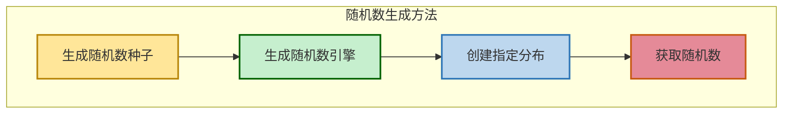
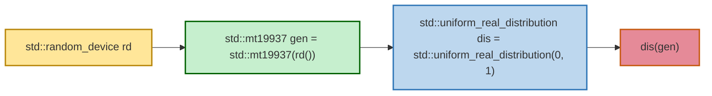
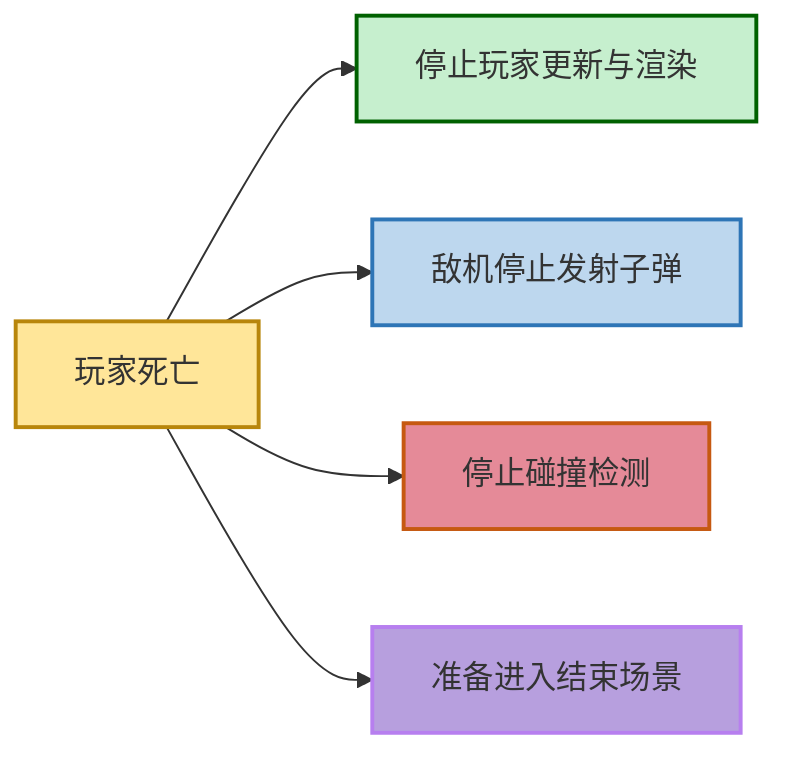

# 目录

```mermaid
graph LR
  A[" "] --> B
  B[" "] --> C
  C[" "] --> D
  D[" "]
  
  style A fill:#ffe699,stroke:#b8860b,stroke-width:2px
  style B fill:#c6efce,stroke:#006100,stroke-width:2px
  style C fill:#bdd7ee,stroke:#2e75b6,stroke-width:2px
  style D fill:#E58A98,stroke:#c65911,stroke-width:2px
```

### 随机数生成

```mermaid
graph LR
	subgraph 随机数生成方法
		direction LR
	  A[生成随机数种子] --> B
	  B[生成随机数引擎] --> C
	  C[创建指定分布] --> D
	  D[获取随机数]
	end
	
	style A fill:#ffe699,stroke:#b8860b,stroke-width:2px
  style B fill:#c6efce,stroke:#006100,stroke-width:2px
  style C fill:#bdd7ee,stroke:#2e75b6,stroke-width:2px
  style D fill:#E58A98,stroke:#c65911,stroke-width:2px
```

```mermaid
graph LR
  A[std::random_device rd] --> B
  B["std::mt19937 gen = std::mt19937(rd())"] --> C
  C["std::uniform_real_distribution<float> dis = std::uniform_real_distribution<float>(0, 1)"] --> D
  D["dis(gen)"]
  
  style A fill:#ffe699,stroke:#b8860b,stroke-width:2px
  style B fill:#c6efce,stroke:#006100,stroke-width:2px
  style C fill:#bdd7ee,stroke:#2e75b6,stroke-width:2px
  style D fill:#E58A98,stroke:#c65911,stroke-width:2px
```

### 敌机生成

```mermaid
graph LR
  A["每帧判断是否生成敌机"] --> B
  B["决定生成的位置，插入容器"] --> C
  C["更新位置并判断是否销毁"] --> D
  D["渲染敌机"]
  
  style A fill:#ffe699,stroke:#b8860b,stroke-width:2px
  style B fill:#c6efce,stroke:#006100,stroke-width:2px
  style C fill:#bdd7ee,stroke:#2e75b6,stroke-width:2px
  style D fill:#E58A98,stroke:#c65911,stroke-width:2px
```

### 敌机子弹生成

```mermaid
graph LR
  A["更新敌机时，判断是否发射"] --> B
  B["决定子弹生成的位置与朝向"] --> C
  C["更新位置并判断是否销毁"] --> D
  D["渲染"]
  
  style A fill:#ffe699,stroke:#b8860b,stroke-width:2px
  style B fill:#c6efce,stroke:#006100,stroke-width:2px
  style C fill:#bdd7ee,stroke:#2e75b6,stroke-width:2px
  style D fill:#E58A98,stroke:#c65911,stroke-width:2px
```

### 碰撞检测

```mermaid
graph LR
  A["子弹update时检测命中：销毁子弹; 减少目标血量"] --> B
  B["敌机update时: 找出血量低于0的敌机并引爆"]
  
  style A fill:#ffe699,stroke:#b8860b,stroke-width:2px
  style B fill:#c6efce,stroke:#006100,stroke-width:2px
```

### 击杀

```mermaid
graph LR
  A["玩家死亡"] --> B["停止玩家更新与渲染"]
  A --> C["敌机停止发射子弹"]
  A --> D["停止碰撞检测"]
  A --> E["准备进入结束场景"]
  
  style A fill:#ffe699,stroke:#b8860b,stroke-width:2px
  style B fill:#c6efce,stroke:#006100,stroke-width:2px
  style C fill:#bdd7ee,stroke:#2e75b6,stroke-width:2px
  style D fill:#E58A98,stroke:#c65911,stroke-width:2px
  style E fill:#B79FDE,stroke:#B77FEF,stroke-width:2px
```